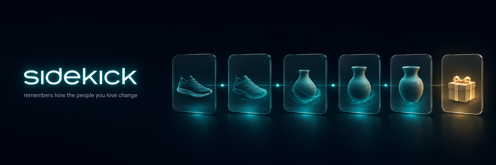

<div align="center">



<br/><br/>

### Tell it about the people you love. When an occasion comes up, it hands you the perfect gesture.

*Birthdays sneak up. The gift is always generic. Sidekick is the friend who was paying attention.*

<br/>

[](#-why-it-wins)
[](https://hydradb.com)
[](https://nebius.ai)
[](https://nextjs.org)
[](LICENSE)

<br/>

**[ Agents you Love — Hackathon · SF · June 21, 2026 ]**

</div>

---

<div align="center">

> ### 💥 The money-shot
> Type **“my sister’s birthday is next week.”**
> Sidekick proposes a **6-week pottery class** — *not* running gear — because it caught that
> she **quit running and got into pottery weeks ago**, and drafts a card nodding to the
> half-marathon she just ran.
>
> **One screen. ~15 seconds. The magic is memory of a *change over time*.**

</div>

<!-- TODO: drop the demo GIF here for the win — docs/assets/money-shot.gif -->
<!-- <div align="center"></div> -->

---

## 🧠 The problem

We remember the people we love **badly**. We forget what they told us, their tastes drift,
and when the moment comes we reach for the same generic gift. Most “AI assistants” have the
same disease: **amnesia between sessions**. They never build a real, evolving picture of a person.

## ✨ What Sidekick does

1. **You teach it, casually.** *“Maya’s been into pottery lately, quit running after her race.”*
2. **It writes — it never overwrites.** The old memory stays, dated; the new one is added.
   Sidekick now *knows her taste changed*.
3. **An occasion comes up.** Tap a birthday → Sidekick recalls the **specific, dated** memories…
4. **…and hands you the gesture.** A concrete gift + a drafted message — each citing the
   exact memories it drew on, with a **“What changed”** band showing the shift it caught.

> The difference between a generic gift and one that says *“I was paying attention.”*

---

## 🏆 Why it wins

| Prize track | Fit |
|---|---|
| 🎯 **Best Use of Memory / Context** | Temporal recall is the whole product — it remembers how a person *evolved*, not just facts. |
| 🎯 **Best Agent People Love** | The gesture is emotional, human, and specific. It feels like a thoughtful friend. |
| 🎯 **Most Creative Build** | “Memory of a change over time” as the headline feature, not a chatbot wrapper. |

**The wow isn’t recall — it’s recall of a *change*.** Running → pottery. Old idea retired,
new one surfaced, with dates. That’s only possible with a real memory layer.

---

## 🛠️ How it’s built

```
            you teach it ──▶  POST /api/memory  ──▶  ┌──────────────┐
                                                      │   HydraDB    │  dated, append-only
                                                      │  memory layer│  per-person recall
   tap an occasion ──▶ POST /api/gesture ──┐          └──────┬───────┘
                                            │  recall (recencyBias) │
                                            ▼                       ▼
                                     ┌──────────────┐        cited dated memories
                                     │    Nebius    │ ◀── synthesize ──┘   + "what changed"
                                     │  Llama-3.1   │
                                     │   70B-fast   │
                                     └──────┬───────┘
                                            ▼
                                  🎁 GestureCard (gift + drafted message)
```

| Layer | Tech | Load-bearing role |
|---|---|---|
| **Memory** | **HydraDB** `@hydradb/sdk` | Stores **dated, append-only** memories per person; recall with `recencyBias` surfaces the *latest* taste. Delete it → generic suggestions, the magic dies. |
| **Reasoning** | **Nebius** (`openai` SDK · `Meta-Llama-3.1-70B-Instruct-fast`) | Turns recalled memories into one *specific, personal* gesture + message. |
| **App** | **Next.js 15 · React 19 · Tailwind v4** | One polished, projector-legible screen. Accent `#0E8C8C`. |

> **The temporal trick:** HydraDB has no native “supersede” field, so Sidekick encodes the
> timeline in **dated memory text + `recencyBias`**. The dimmed “retired” chips and the
> **What changed** band are computed from those dates — recall ranks *pottery* above *running*.

---

## 🚀 Run it

**Runs with zero keys.** The full money-shot works out of the box on a seeded demo, so the
demo can never break. Add keys to flip it to **live** HydraDB recall + Nebius synthesis — *no code change*.

```bash
npm install
npm run dev          # ▶ http://localhost:3000  — seeded demo, no keys needed
```

<details>
<summary><b>Go live (real HydraDB + Nebius)</b></summary>

```bash
cp .env.example .env.local      # paste your two keys
npm run smoke:hydra             # ✅ recall ranks pottery above running
npm run smoke:nebius            # ✅ inference reachable
npm run seed:hydra              # ✅ ingest the 3 people so live recall has real data
npm run dev                     # /api/gesture now auto-flips to live; seeded stays as fallback
```
> HydraDB ingest is **async** — `seed:hydra` polls until `completed`. Free “Ship” tier, no card:
> [dashboard.hydradb.com](https://dashboard.hydradb.com/sign-up).

</details>

### Scripts

| Command | What it does |
|---|---|
| `npm run dev` | Start the app (seeded demo by default) |
| `npm run build` | Production build |
| `npm run seed:hydra` | Ingest the 3 seeded people into HydraDB |
| `npm run smoke:hydra` | Verify recall ranks the *latest* taste first |
| `npm run smoke:nebius` | Verify Nebius inference is reachable |

---

## 🗂️ Project structure

```
app/
  api/memory/route.ts     # write a new dated memory  → HydraDB
  api/gesture/route.ts    # recall + synthesize       → HydraDB + Nebius
  page.tsx                # the single screen
components/
  PersonCard.tsx          # the 3-up people grid
  MemoryTimeline.tsx      # dated chips; retired tastes dimmed
  TellMeInput.tsx         # "teach it one thing" (optimistic write)
  GestureCard.tsx         # 🎁 the money-shot: gift + message + "what changed"
lib/
  hydra.ts                # HydraDB client (graceful seeded fallback)
  nebius.ts               # Nebius client (graceful seeded fallback)
  gesture.ts              # recall → synthesize pipeline
  seed.ts                 # the 3 seeded people
scripts/                  # seed + smoke tests
```

---

## 🎬 Demo (15 seconds)

1. **3 people** — Maya (sister), Dad, Priya — each with a next-occasion pill.
2. Teach it: *“Maya’s been into pottery lately, quit running after her race”* → a new **dated** chip animates in.
3. Tap **“Birthday next week”** → *Recalling Maya…*
4. 💥 **GestureCard**: pottery course + a card nodding to her half-marathon + cited dated chips +
   the teal **“What changed: running → pottery”** band.

---

## 🧱 Honest scope (built in ~4h, solo)

**Built & verified:** the full seeded money-shot, live HydraDB + Nebius behind keys with seeded fallback.
**Intentionally cut:** auth/login · real contact & calendar sync (occasion is a button) · push notifications · Flux gift-card image · mobile polish.

---

## 📦 Built with

**[HydraDB](https://hydradb.com)** · **[Nebius](https://nebius.ai)** · [Next.js 15](https://nextjs.org) · [React 19](https://react.dev) · [Tailwind CSS v4](https://tailwindcss.com) · TypeScript

---

<div align="center">

*Sidekick remembers how the people you love change — so you never give a generic gift again.*

**MIT** © 2026 Damien Aubry

</div>
